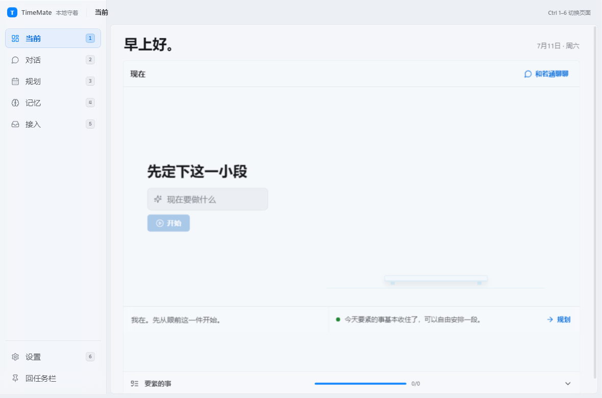
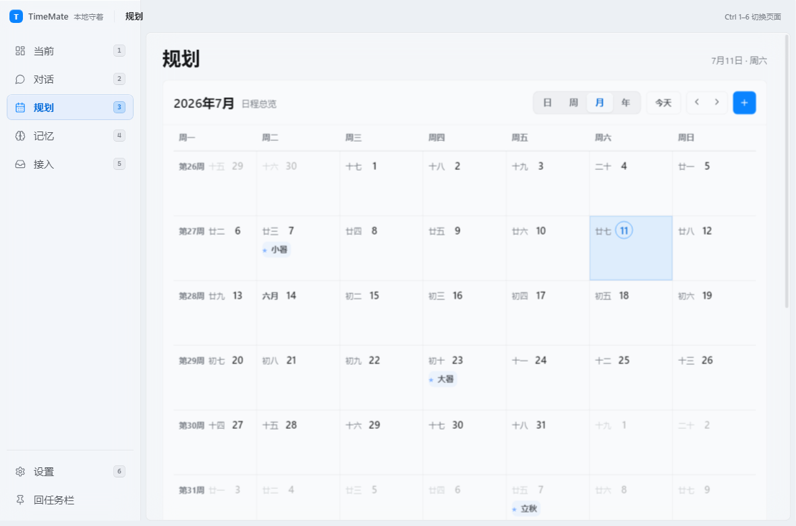
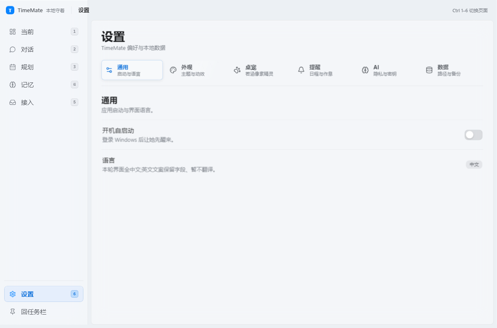
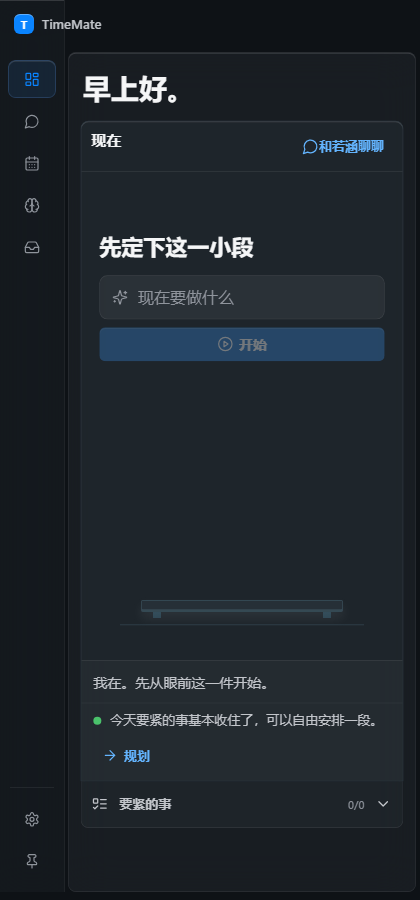
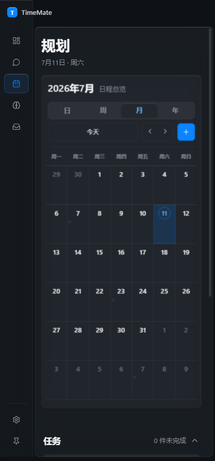

# TimeMate

TimeMate 是一个面向 Windows 的本地优先时间管理与陪伴型桌面应用。它把当前活动、任务与日历、长期记忆、对话助手、外部线索确认和 2D 像素桌宠放在同一个 Electron 工作区中，目标不是把时间排满，而是帮助用户看清当下、安排下一步，并保留最终决定权。

当前仓库提供可运行的开发版源码，尚未提供安装器。项目状态、验证边界与后续工作见 [PROJECT_STATUS](docs/PROJECT_STATUS.md)，完整验证摘要见 [VERIFICATION](docs/VERIFICATION.md)。

## 主要功能

- **当前活动**：记录正在进行的事项、持续时间与心情，并以完成、中断、停滞等状态收尾。
- **任务与规划**：创建、完成、恢复和删除任务，支持优先级、任务类型、到期时间与当日时间线。
- **完整日历视图**：提供日、周、月、年视图，可创建和删除日程，并保留农历、今日、选中日期和日程检查面板。
- **记忆管理**：保存事实、目标、情绪模式、偏好与边界；支持搜索、筛选、确认推测、禁止再次提及和删除。
- **陪伴式对话**：无 API Key 时使用本地回复；配置外部模型后可调用 DeepSeek 兼容接口。私人模式或检测到强敏感内容时强制留在本地。
- **数据与隐私**：业务数据保存到本地 SQLite，支持完整 JSON 导入、导出与快照复制；AI 审计仅保存脱敏摘要。
- **桌面集成**：系统托盘、单实例、开机自启动、主窗口隐藏后继续运行，以及独立桌宠窗口。
- **外部线索确认**：飞书、邮箱、微信和 iCloud 日历目前展示为规划中的来源；线索模型与“先确认、后写入任务”的队列界面已经就位，真实连接器尚未完成。

## 2D 像素桌宠

当前活动运行时使用“若涵 · 像素桌宠”模型，不再依赖 Live2D 或 Layered2D。

- 24 张真实 PNG 帧：3 种位置 × 8 种状态。
- 位置：`taskbar`、`window-seat`、`free`。
- 状态：`idle`、`focus`、`happy`、`worried`、`asking`、`sleeping`、`tap`、`drag`。
- 原始帧为 48×64 像素，使用 nearest-neighbor / `image-rendering: pixelated` 渲染。
- 支持点击短反应、拖动与位置保存、边缘吸附、双击打开主窗口、任务栏停靠、窗口座位、缩放、置顶、隐藏和鼠标穿透。
- 开启鼠标穿透后，可从系统托盘菜单选择“恢复桌宠交互”。

迁移前的 Live2D / Layered2D 运行时与角色资源已经从活动源码和构建产物中移除；回退材料保存在活动仓库之外的工作区归档中，不属于当前发布运行时。

## 液态玻璃 UI

六个主页面——当前、对话、规划、记忆、接入、设置——使用统一的液态玻璃设计系统：

- 设计令牌集中管理排版、4px 间距阶梯、圆角、半透明表面、描边、阴影、语义色和焦点环。
- 浅色、深色和跟随系统模式共享组件语义。
- “降低透明度”会关闭背景采样与模糊，切换到更稳定的高对比实色表面。
- 主窗口采用连续舞台背景，首页不再存在贯穿全高的硬分区。
- 桌面与窄窗口使用同一套组件，并针对 420px 宽度处理导航、七列月历和横向溢出。

## 交互与动画

- 按压、快速状态、页面切换和 sheet 动画分别使用约 90ms、130ms、200ms、260ms 的节奏。
- 页面进入只使用 6px 水平位移与透明度；日历空间过渡上限为 280ms。
- 支持系统 `prefers-reduced-motion` 和应用内“减弱动效”，减动模式会移除位移并保证首帧内容可见。
- 支持键盘 `Ctrl+1` 到 `Ctrl+6` 切换六个主页面，并包含跳过导航、焦点转移、ARIA 标签和键盘可操作设置分组。
- 快速切页和弹层切换保持单页面、单对话框与单遮罩契约。

## 截图

以下截图从有效 smoke 批次 `2026-07-10T23-07-33-106Z` 中精选并脱离原始验证目录保存。原始 `desktop/verification/` 仅用于本地测试且不会上传。

| 首页桌面 | 规划桌面 | 设置桌面 |
| --- | --- | --- |
| [](docs/assets/timemate-home-desktop.png) | [](docs/assets/timemate-planner-desktop.png) | [](docs/assets/timemate-settings-desktop.png) |

| 420px 首页 | 420px 规划 |
| --- | --- |
| [](docs/assets/timemate-home-420px.png) | [](docs/assets/timemate-planner-420px.png) |

## 技术栈

- Electron 33
- React 18
- TypeScript 5.7
- Vite 6
- sql.js / SQLite
- Lucide React

## 目录结构

```text
.
├─ desktop/
│  ├─ src/
│  │  ├─ main/          # Electron 主进程、SQLite、AI 与安全存储
│  │  ├─ preload/       # contextBridge / IPC 边界
│  │  ├─ renderer/      # React 页面、组件、样式与像素资产
│  │  └─ shared/        # 主进程与渲染进程共享类型
│  ├─ scripts/          # 开发启动与 smoke 驱动
│  ├─ design/           # 设计令牌和资产说明
│  ├─ verification/     # 本地 smoke JSON 与原始截图证据（Git 忽略）
│  ├─ package.json
│  └─ package-lock.json
├─ docs/
│  ├─ assets/           # 精选、脱敏的仓库截图
│  ├─ PROJECT_STATUS.md
│  └─ VERIFICATION.md
├─ CHANGELOG.md
└─ README.md
```

## Windows 开发依赖

- Windows 10 或 Windows 11。
- Node.js 与 npm，建议使用当前 LTS 版本。
- Git，仅在需要克隆、查看历史或提交代码时使用。

项目没有额外的全局构建工具要求。依赖由 `desktop/package-lock.json` 固定；`desktop/.npmrc` 只包含 npm 与 Electron 镜像地址，不包含认证信息。npm 已提示其中旧式 `electron_mirror` / `electron_builder_binaries_mirror` 配置将在后续 major 版本停止支持，升级 npm 或 Electron 工具链时需要迁移。

## 安装与启动

在仓库根目录执行。

### PowerShell

```powershell
Set-Location .\desktop
npm.cmd ci
npm.cmd run dev
```

### CMD

```bat
cd desktop
npm ci
npm run dev
```

开发命令会启动本地 Vite 服务、编译 Electron 主进程并打开应用。

如需从生产构建启动：

```powershell
Set-Location .\desktop
npm.cmd run build
npm.cmd run start
```

## 测试命令

```powershell
Set-Location .\desktop

# TypeScript
npm.cmd run typecheck

# 主进程与渲染进程生产构建
npm.cmd run build

# 构建 + Electron full/persist/visual smoke
npm.cmd run smoke
```

当前有效验证基线为 `2026-07-10T23-07-33-106Z`：Legacy `104/104`、Visual `22/22`、总计 `127/127`。由于当前开发工作树仍可能包含该批次之后的运行时代码变化，正式发布前应对拟提交快照重新执行完整 smoke。

## 安全说明

- 不要把 API Key 写入源码、README、Issue、日志或提交历史；示例只能使用 `sk-...` 之类的占位符。
- API Key 通过 Electron `safeStorage` 加密后保存在本机；系统不支持 `safeStorage` 时不应绕过保护写入明文。
- 私人模式不会调用外部模型；强敏感文本会自动使用本地回复。
- JSON 导出可能包含任务、日程、记忆、聊天和 AI 审计摘要，分享前必须检查并脱敏。
- JSON 导入会整体替换当前数据，执行前应先导出备份。
- 不要提交个人日历、用户数据库、真实聊天记录或本地调试产物。

## 文档

- [更新日志](CHANGELOG.md)
- [项目状态](docs/PROJECT_STATUS.md)
- [验证记录](docs/VERIFICATION.md)
